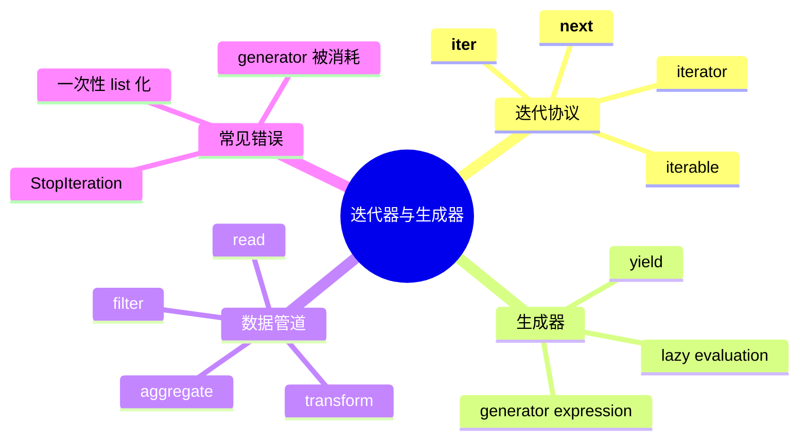

# Kabuqina Course0 · Python 高级程序设计课程结构建议

> 适用仓库：`Kabuqina/course0-Advanced-Programming-of-Python`  
> 课程定位：面向已经学过 Python 基础语法的学习者，从“会写脚本”推进到“能写可维护、可测试、可解释、可被小娜读取和辅导的 Python 工程代码”。

---

## 1. 课程总目标

这门课不建议做成“高级语法大全”，而应做成一条清晰的能力升级线：

1. **理解 Python 的运行模型**：对象、名字、作用域、可变性、数据模型、协议。
2. **掌握高级语言机制**：迭代器、生成器、闭包、装饰器、上下文管理器、描述符、元编程。
3. **进入工程实践**：异常、日志、类型标注、测试、项目结构、依赖管理、打包、CLI。
4. **处理真实数据与异步任务**：CSV/JSON/日志/SQLite、流式处理、并发、asyncio。
5. **完成一个小型综合项目**：让学生把每课知识组合成一个可运行、可测试、可讲解的工具。
6. **服务 Kabuqina 学习功能**：每个 lesson 都有机器可读的 metadata、讲义、示例、练习、测试、数据和小娜提示词。

---

## 2. 建议仓库结构

建议保留现有 `data/`、`lessons/`、`tests/` 三大目录，但把 lesson 内部结构标准化。

```text
course0-Advanced-Programming-of-Python/
├── README.md
├── COURSE_STRUCTURE.md              # 本课程结构说明
├── SYLLABUS.md                       # 给学生看的课程大纲
├── REFERENCES.md                     # 资料、文献、官方文档、延伸阅读
├── CONTRIBUTING.md                   # 学生/协作者如何提交资源
├── pyproject.toml
├── requirements.txt
├── data/
│   ├── README.md
│   ├── common/                       # 多课共用数据
│   ├── lesson_03_iterators/
│   ├── lesson_08_files_data/
│   └── lesson_15_capstone/
├── lessons/
│   ├── 00_orientation/
│   ├── 01_objects_names_mutability/
│   ├── 02_functions_closures/
│   ├── 03_iterators_generators/
│   ├── 04_itertools_pipelines/
│   ├── 05_decorators/
│   ├── 06_context_managers/
│   ├── 07_data_model_protocols/
│   ├── 08_exceptions_logging/
│   ├── 09_type_hints_dataclasses/
│   ├── 10_files_serialization_sqlite/
│   ├── 11_testing_pytest/
│   ├── 12_project_structure_packaging_cli/
│   ├── 13_concurrency_threads_processes/
│   ├── 14_asyncio/
│   ├── 15_descriptors_metaprogramming/
│   └── 16_capstone_project/
├── tests/
│   ├── test_03_iterators_generators.py
│   ├── test_05_decorators.py
│   └── ...
├── scripts/
│   ├── run_lesson.py                 # 统一运行 lesson 示例
│   ├── check_lesson_pack.py           # 检查每课资源是否齐全
│   └── export_slides.py               # 可选：从 HTML/Markdown 导出 PDF
└── assets/
    ├── images/
    ├── mindmaps/
    └── templates/
```

---

## 3. 每个 lesson 的标准资源包

每个 lesson 最好统一成以下结构，方便学生学习，也方便小娜读取、检索和辅导。

```text
lessons/03_iterators_generators/
├── metadata.yml              # 机器可读课程信息
├── README.md                 # 给学生看的入口页
├── lecture.md                # 详细讲义
├── examples.py               # 一份可直接运行的主示例
├── examples/                 # 多个小示例，可选
│   ├── 01_manual_iterator.py
│   ├── 02_generator_pipeline.py
│   └── 03_streaming_csv.py
├── exercises.py              # 练习骨架
├── solutions.py              # 参考解答
├── notes_for_teacher.md      # 教师讲解备注，可选
├── kabuqina_cards.md          # 给小娜读取的问答卡片/知识卡片
├── prompts.md                # 用小娜辅导本课时可用的提示词
├── slides.html               # HTML 课件，可选
├── slides.pdf                # PDF 课件，可选
├── mindmap.mmd               # Mermaid 思维导图，可选
└── data_manifest.md          # 本课使用哪些 data 文件
```

### metadata.yml 模板

```yaml
lesson_id: 03
slug: iterators_generators
title: 迭代器与生成器
level: intermediate
estimated_time: 90min
prerequisites:
  - 函数
  - for 循环
  - 文件读取基础
keywords:
  - iterable
  - iterator
  - generator
  - yield
  - lazy evaluation
  - pipeline
learning_outcomes:
  - 区分 iterable 与 iterator
  - 能手写一个迭代器类
  - 能用生成器处理大文件或流式数据
  - 能组合多个生成器形成数据处理管道
run_commands:
  - python lessons/03_iterators_generators/examples.py
  - pytest tests/test_03_iterators_generators.py
datasets:
  - data/common/numbers.txt
  - data/lesson_03_iterators/sales.csv
kabuqina_use:
  readable_by_assistant: true
  explainable_units:
    - concept
    - code_demo
    - exercise
    - common_errors
```

---

## 4. 课程总模块设计

建议做成 **17 个 lesson：00 导入 + 15 个主题课 + 1 个综合项目**。如果课堂时间较少，可以把 lesson 04、15 作为选讲。

| Lesson | 文件夹 | 核心问题 | 产出 |
|---|---|---|---|
| 00 | `00_orientation` | 这门课如何学习？仓库如何运行？ | 配好环境，跑通 pytest |
| 01 | `01_objects_names_mutability` | Python 变量到底是什么？为什么可变对象会“坑”人？ | 对象/引用/作用域实验 |
| 02 | `02_functions_closures` | 函数为什么也是对象？闭包怎么保存状态？ | 闭包计数器、函数工厂 |
| 03 | `03_iterators_generators` | 如何写惰性、低内存的数据流？ | 日志/CSV 流式处理 |
| 04 | `04_itertools_pipelines` | 如何组合小函数形成数据管道？ | 数据清洗 pipeline |
| 05 | `05_decorators` | 如何在不改业务代码的情况下增加功能？ | timer/cache/retry/log 装饰器 |
| 06 | `06_context_managers` | 如何可靠释放资源？ | 文件锁、临时配置、计时器 |
| 07 | `07_data_model_protocols` | Python 对象如何变得像内置类型一样好用？ | 自定义容器、`__repr__`、`__len__` |
| 08 | `08_exceptions_logging` | 程序出错时如何让人看得懂、查得到？ | 日志化错误报告 |
| 09 | `09_type_hints_dataclasses` | 类型标注怎样帮助阅读和维护？ | dataclass 配置对象、Protocol |
| 10 | `10_files_serialization_sqlite` | 如何处理真实数据文件？ | CSV/JSON/SQLite 小型数据管理器 |
| 11 | `11_testing_pytest` | 怎么知道代码真的对？ | 单元测试、参数化测试、fixture |
| 12 | `12_project_structure_packaging_cli` | 脚本如何变成小项目？ | 可安装 CLI 小工具 |
| 13 | `13_concurrency_threads_processes` | 线程、进程、GIL 怎么理解？ | 并发下载/CPU 任务对比实验 |
| 14 | `14_asyncio` | 异步任务如何调度？ | async 爬取模拟器/异步任务队列 |
| 15 | `15_descriptors_metaprogramming` | Python 类如何自我改造？ | 字段校验、插件注册、ORM 雏形 |
| 16 | `16_capstone_project` | 如何把高级机制组合成一个工具？ | 课程资源包检查器/日志分析器/小娜学习包 runner |

---

## 5. 每个 lesson 的细化设计

### Lesson 00 · Orientation：课程导入与仓库运行

**目标**
- 明确课程定位：不是重复基础语法，而是学习 Python 的“机制”和“工程化”。
- 跑通虚拟环境、依赖安装、示例运行、pytest。
- 让学生理解仓库结构：`lessons/`、`data/`、`tests/`。

**知识点**
- venv / pip / requirements
- `python -m` 的基本用法
- pytest 基础运行
- GitHub 资源包的阅读方式

**代码案例**
- `hello_course.py`：检查 Python 版本、当前路径、导入路径。
- `run_lesson.py`：根据 lesson id 运行示例。

**练习**
- 修改一个简单函数，让测试通过。
- 给自己的本地环境写一份 `environment_check.md`。

**资料关键词**
- Python venv
- pytest getting started
- pyproject.toml

---

### Lesson 01 · Objects, Names, Mutability：对象、名字与可变性

**核心问题**
- Python 里的“变量”不是盒子，而是名字绑定到对象。
- 为什么 `list` 默认参数会产生 bug？
- 为什么 `a = b` 不等于复制？

**知识点**
- object / identity / type / value
- `id()`、`is`、`==`
- mutable vs immutable
- shallow copy vs deep copy
- LEGB 作用域与命名空间

**代码案例**
- `identity_demo.py`：`id()`、`is`、`==` 实验。
- `mutable_default_bug.py`：可变默认参数陷阱。
- `copy_demo.py`：浅拷贝/深拷贝。
- `scope_demo.py`：local / nonlocal / global。

**数据/素材**
- 无需复杂数据。可用嵌套 list/dict 模拟学生成绩表。

**练习**
- 修复“学生成绩追加函数”的可变默认参数 bug。
- 实现 `safe_update_config(base, patch)`，不能污染原始配置。
- 解释 5 段代码输出，写进 `answers.md`。

**小娜辅导点**
- 让小娜逐行问：“这一行创建了新对象，还是多了一个名字？”

---

### Lesson 02 · Functions and Closures：函数对象、作用域与闭包

**核心问题**
- 函数为什么可以被传递、返回、存入列表？
- 闭包为什么能“记住”外层变量？

**知识点**
- first-class function
- higher-order function
- closure
- `nonlocal`
- function attributes
- `*args` / `**kwargs`

**代码案例**
- `callback_demo.py`：把函数作为参数。
- `make_counter.py`：闭包保存状态。
- `function_registry.py`：函数注册表雏形。
- `partial_demo.py`：可选，`functools.partial`。

**练习**
- 实现 `make_accumulator(start=0)`。
- 实现 `make_filter(predicate)`。
- 写一个简易命令注册器：`register(name, func)`。

**后续连接**
- 为 Lesson 05 装饰器做铺垫。

---

### Lesson 03 · Iterators and Generators：迭代器与生成器

**核心问题**
- 如何不用一次性读完整个文件？
- `for` 循环背后到底发生了什么？

**知识点**
- iterable / iterator
- `__iter__` / `__next__`
- `StopIteration`
- `yield`
- generator expression
- lazy evaluation
- `yield from`

**代码案例**
- `manual_iterator.py`：手写迭代器类。
- `read_numbers.py`：生成器逐行读取。
- `csv_pipeline.py`：销售数据流式聚合。
- `yield_from_tree.py`：展开嵌套结构。

**数据**
- `data/lesson_03_iterators/numbers.txt`
- `data/lesson_03_iterators/sales.csv`

**练习**
- `running_max(iterable)`：运行最大值。
- `chunk(iterable, size)`：切块。
- `revenue_by_region(path)`：按地区统计销售额。
- `flatten(items)`：递归/生成器展开嵌套 list。

**小娜辅导点**
- 对比 `list(read_numbers(path))` 与直接迭代的内存差异。

---

### Lesson 04 · itertools and Pipelines：函数式工具与数据管道

**核心问题**
- 如何用小而清楚的处理步骤拼成一个数据处理流程？

**知识点**
- `map` / `filter` / generator expression
- `itertools.chain`、`islice`、`groupby`、`tee`
- pipeline thinking
- pure function vs side effect

**代码案例**
- `pipeline_sales.py`：读取、清洗、过滤、聚合。
- `top_n.py`：取前 N 条数据。
- `groupby_pitfall.py`：`groupby` 需要先排序。

**数据**
- 延续 `sales.csv`
- 可增加 `dirty_sales.csv`，包含缺失值、异常行。

**练习**
- 写一个 `compose(*funcs)`。
- 实现 `clean_rows(rows)`。
- 实现 `top_products(path, n=3)`。

**是否必讲**
- 如果课时紧张，可以并入 Lesson 03。

---

### Lesson 05 · Decorators：装饰器与横切关注点

**核心问题**
- 如何在不改业务函数内部代码的情况下加日志、计时、缓存、重试？

**知识点**
- decorator 本质：`func = deco(func)`
- wrapper
- `functools.wraps`
- 带参数装饰器
- 装饰器顺序
- class-based decorator，可选

**代码案例**
- `timer.py`：函数耗时。
- `call_counter.py`：调用次数。
- `retry.py`：失败重试。
- `simple_cache.py`：缓存。
- `log_calls.py`：记录函数输入输出。

**数据**
- `access.log` 可用于日志解析函数的计时与缓存。

**练习**
- 实现 `@timer`。
- 实现 `@retry(times=3, delay=0.1)`。
- 实现 `@validate_non_empty`。
- 思考：为什么不用 `wraps` 会影响调试和文档？

**小娜辅导点**
- 让小娜把三层带参数装饰器画成“盒中盒”。

---

### Lesson 06 · Context Managers：上下文管理器与资源安全

**核心问题**
- 为什么 `with open(...)` 即使异常也能关闭文件？
- 如何自己写一个可用于 `with` 的对象？

**知识点**
- `with` 语句
- `__enter__` / `__exit__`
- exception suppression
- `contextlib.contextmanager`
- `ExitStack`，可选

**代码案例**
- `managed_file.py`：手写文件上下文。
- `timer_context.py`：计时器上下文。
- `temp_config.py`：临时修改配置，退出后恢复。
- `suppress_demo.py`：是否吞掉异常。

**练习**
- 实现 `Timer`。
- 实现 `temporary_env(key, value)`。
- 实现 `open_many(paths)`，确保异常时全部关闭。

**工程连接**
- 和 Lesson 08 异常、Lesson 10 文件处理连接。

---

### Lesson 07 · Data Model and Protocols：数据模型与协议

**核心问题**
- 为什么一个对象可以被 `len()`、`for`、`in`、`[]` 使用？
- 如何让自定义类像 Python 内置类型一样自然？

**知识点**
- special methods / dunder methods
- `__repr__` / `__str__`
- `__len__` / `__iter__` / `__contains__` / `__getitem__`
- equality and hashing：`__eq__` / `__hash__`
- ordering：`__lt__`，可选

**代码案例**
- `playlist.py`：可迭代歌单/书单。
- `gradebook.py`：支持 `len()`、`in`、索引。
- `money.py`：值对象、相等与 hash。

**数据**
- `books.json`
- `students.json`

**练习**
- 实现一个 `BookShelf` 类，使它支持 `len(shelf)`、`for book in shelf`、`"Python" in shelf`。
- 实现 `__repr__`，让调试输出可读。
- 解释为什么可变对象不适合直接 hash。

---

### Lesson 08 · Exceptions and Logging：异常、日志与可诊断性

**核心问题**
- 写程序不是“不出错”，而是“出错时能定位、能恢复、能解释”。

**知识点**
- exception hierarchy
- `try` / `except` / `else` / `finally`
- 自定义异常
- EAFP vs LBYL
- `logging` basic config
- 日志等级：DEBUG / INFO / WARNING / ERROR

**代码案例**
- `parse_config.py`：配置解析错误。
- `safe_reader.py`：文件读取错误处理。
- `logging_demo.py`：日志格式与等级。
- `domain_error.py`：自定义业务异常。

**数据**
- `bad_config.json`
- `malformed_sales.csv`

**练习**
- 给 Lesson 03 的 CSV 解析器加错误处理。
- 实现 `load_json(path)`，区分“文件不存在”和“JSON 格式错误”。
- 将 `print` 调试改成 `logging`。

**小娜辅导点**
- 让小娜根据 traceback 帮学生定位“真正第一处错误”。

---

### Lesson 09 · Type Hints, Dataclasses and Protocols：类型标注、数据类与接口思维

**核心问题**
- 类型标注不是为了让 Python 变成 Java，而是为了让代码更可读、更可维护、更适合工具理解。

**知识点**
- basic annotations
- `list[str]`、`dict[str, int]`
- `Optional` / `| None`
- `Callable`
- `Protocol`
- `dataclasses.dataclass`
- `field(default_factory=...)`

**代码案例**
- `book_model.py`：用 dataclass 表示图书。
- `config_model.py`：配置对象。
- `repository_protocol.py`：用 Protocol 表示数据源接口。

**练习**
- 给已有函数补充类型标注。
- 把 dict 配置改成 dataclass。
- 写一个 `Readable` Protocol，只要求对象有 `read()` 方法。

**注意**
- 类型标注本身通常不在运行时强制检查，课程里要明确“静态工具辅助”和“运行时验证”的区别。

---

### Lesson 10 · Files, Serialization and SQLite：文件、序列化与轻量数据库

**核心问题**
- 真实项目里的数据通常来自文件、日志、表格或小型数据库，如何可靠读写？

**知识点**
- `pathlib.Path`
- text encoding
- CSV
- JSON
- SQLite basic CRUD
- data validation
- resource management

**代码案例**
- `pathlib_demo.py`
- `csv_reader.py`
- `json_store.py`
- `sqlite_books.py`
- `data_exporter.py`

**数据**
- `books.json`
- `sales.csv`
- `students.csv`
- `library.sqlite`，可生成，不一定入库。

**练习**
- 把 `books.json` 导入 SQLite。
- 查询某作者/某年份之后的图书。
- 导出统计结果为 CSV。

**工程连接**
- 为 capstone 的“课程资源包索引器”铺垫。

---

### Lesson 11 · Testing with pytest：测试、回归与可验证代码

**核心问题**
- 如何把“我觉得能跑”变成“我能证明它在这些场景下是对的”？

**知识点**
- test function naming
- assert
- parameterized test
- fixture
- temporary path
- exception test
- regression test

**代码案例**
- `test_running_max.py`
- `test_config_loader.py`
- `test_book_model.py`

**练习**
- 给 Lesson 03 的生成器函数补测试。
- 给 Lesson 08 的错误处理补测试。
- 写一个失败测试，再修复实现。

**小娜辅导点**
- 小娜可以先不直接给答案，而是问：“你希望这个函数在空输入时返回什么？”

---

### Lesson 12 · Project Structure, Packaging and CLI：项目结构、打包与命令行工具

**核心问题**
- 一个脚本如何升级为一个可以安装、测试、复用的小项目？

**知识点**
- src layout vs flat layout
- module and package
- `__init__.py`
- `pyproject.toml`
- console scripts
- dependency management
- semantic versioning，浅讲
- README / LICENSE / CHANGELOG

**代码案例**
- `mini_tool/`：一个可安装的小包。
- `kq_course_runner`：命令行读取 lesson metadata 并运行测试。

**练习**
- 把一个单文件脚本拆成包。
- 增加 CLI 参数：`--lesson 03`、`--run-tests`。
- 写最小 README。

**产出**
- 一个可执行命令：`python -m kq_course_runner --lesson 03`。

---

### Lesson 13 · Concurrency with Threads and Processes：线程、进程与并发模型

**核心问题**
- 程序慢时，到底是 I/O 慢，还是 CPU 慢？该用线程、进程还是异步？

**知识点**
- concurrency vs parallelism
- I/O-bound vs CPU-bound
- GIL 基本概念
- `threading`
- `concurrent.futures.ThreadPoolExecutor`
- `ProcessPoolExecutor`
- race condition and lock，浅讲

**代码案例**
- `io_bound_threads.py`：模拟多个文件读取/请求。
- `cpu_bound_processes.py`：计算任务对比。
- `race_condition.py`：共享状态问题。

**数据**
- 多个小文本文件/日志文件。

**练习**
- 并发统计多个日志文件状态码。
- 对比串行、线程池、进程池运行时间。
- 找出 race condition 并修复。

---

### Lesson 14 · asyncio：异步 I/O 与任务调度

**核心问题**
- `async` / `await` 到底是在解决什么问题？为什么不是“自动加速”？

**知识点**
- coroutine
- event loop
- task
- `asyncio.run`
- `asyncio.gather`
- timeout
- cancellation
- semaphore
- async generator，可选

**代码案例**
- `async_sleep_demo.py`
- `fake_api_client.py`
- `async_book_fetcher.py`
- `bounded_concurrency.py`

**数据**
- `books.json` 模拟远程 API 返回。

**练习**
- 异步读取/模拟获取图书详情。
- 限制最大并发数。
- 给任务加 timeout 和错误收集。

**小娜辅导点**
- 用时间线解释“谁在等待、谁在继续执行”。

---

### Lesson 15 · Descriptors and Metaprogramming：描述符与元编程

**核心问题**
- Python 的类和属性并不是死的，它们可以被协议和钩子改造。

**知识点**
- descriptor protocol：`__get__` / `__set__` / `__delete__`
- `property`
- `__set_name__`
- `__init_subclass__`
- class registry
- metaclass，浅讲，不宜过深

**代码案例**
- `validated_field.py`：字段校验描述符。
- `book_model_descriptor.py`：图书字段校验。
- `plugin_registry.py`：自动注册子类。
- `mini_orm.py`：非常小的 ORM 思路演示。

**练习**
- 实现 `PositiveNumber` 描述符。
- 实现 `NonEmptyString` 描述符。
- 用 `__init_subclass__` 自动注册不同数据解析器。

**教学提醒**
- 这一课要强调“知道机制”和“谨慎使用”。不要让学生误以为元编程越多越高级。

---

### Lesson 16 · Capstone Project：综合项目

建议提供三个项目选题，学生任选一个。最好都能被小娜读取、运行、解释。

#### 选题 A：Course Resource Pack Checker

**目标**
- 检查每个 lesson 是否包含 `metadata.yml`、`README.md`、`examples.py`、`exercises.py`、`solutions.py`、测试文件。
- 汇总缺失项，生成报告。
- 可作为 Kabuqina 后续课程资源包的真实工具。

**会用到的知识**
- pathlib
- dataclass
- iterator/generator
- context manager
- logging
- pytest
- CLI

**最终命令**
```bash
python -m kq_course_checker --root . --format markdown
```

#### 选题 B：Log Analyzer Toolkit

**目标**
- 读取 access.log，按 IP、路径、状态码、时间段统计。
- 支持大文件流式处理。
- 输出 CSV / JSON 报告。

**会用到的知识**
- generator pipeline
- regex
- logging
- testing
- CLI
- concurrency，可选

#### 选题 C：Mini Async Book Enricher

**目标**
- 读取 books.json。
- 异步模拟请求图书详情。
- 限制并发、处理 timeout、输出增强后的 JSON。

**会用到的知识**
- dataclass
- type hints
- asyncio
- exceptions
- serialization
- pytest

---

## 6. 数据集设计建议

数据集不要太大，但要“结构真实”。建议分为 common 和 lesson-specific。

```text
data/
├── README.md
├── common/
│   ├── numbers.txt
│   ├── sales.csv
│   ├── books.json
│   ├── access.log
│   └── students.csv
├── lesson_04_pipelines/
│   └── dirty_sales.csv
├── lesson_08_exceptions/
│   ├── bad_config.json
│   └── malformed_sales.csv
├── lesson_10_sqlite/
│   └── seed_books.sql
└── lesson_16_capstone/
    ├── sample_course_pack/
    └── large_access_sample.log
```

### 数据集说明字段

每个数据文件在 `data/README.md` 中标注：

| 字段 | 含义 |
|---|---|
| filename | 文件名 |
| format | CSV / JSON / TXT / LOG / SQL |
| used_by | 哪些 lesson 使用 |
| size | 小 / 中 / 大 |
| columns/schema | 字段说明 |
| tasks | 可用于哪些练习 |
| license/source | 来源与许可证 |

---

## 7. 课件与思维导图设计

每个 lesson 建议至少有一个思维导图文件，形式可以先用 Mermaid，后续再导出为图片或 HTML。



HTML/PDF 课件建议不要太复杂。每课 10-15 页即可：

1. 本课问题
2. 为什么重要
3. 核心概念图
4. 最小代码例子
5. 常见错误
6. 课堂练习
7. 小项目任务
8. 小结

---

## 8. `kabuqina_cards.md` 模板

这个文件是给小娜读取和辅导用的，建议每课都做。

```md
# Kabuqina Cards · Lesson 03 Iterators and Generators

## Concept Card 1
Q: iterable 和 iterator 的区别是什么？
A: iterable 是“可以被迭代”的对象；iterator 是“正在执行迭代过程”的对象，通常实现 `__next__`。

## Code Card 1
Q: 这段代码为什么不会立刻读取文件？
A: 因为生成器函数调用后只返回 generator object，直到 `next()` 或 `for` 才逐步执行。

## Misconception Card 1
Q: 生成器是不是比 list 永远更快？
A: 不一定。生成器主要优势是惰性和低内存；如果数据很小，list 可能更简单，也可能更快。

## Tutor Prompt
请你像助教一样，先问学生这段代码的输出，再解释 for 循环如何调用 `iter()` 和 `next()`。
```

---

## 9. 生成资料时的优先顺序

为了避免课程变成一堆散资料，建议按这个顺序生成：

1. `COURSE_STRUCTURE.md`：先定全局结构。
2. `SYLLABUS.md`：给学生看的课程说明。
3. 每个 lesson 的 `metadata.yml`。
4. 每个 lesson 的 `README.md`。
5. 每个 lesson 的 `examples.py`。
6. 每个 lesson 的 `exercises.py`。
7. 对应 `tests/test_xx.py`。
8. `solutions.py`。
9. `lecture.md`。
10. `kabuqina_cards.md`。
11. `slides.html` / `mindmap.mmd`。
12. `REFERENCES.md`。

这样做的好处是：代码和测试先成型，讲义和课件围绕可运行内容展开，不会空泛。

---

## 10. 每课生成资料的提示词模板

```text
请为 Kabuqina Course0 的 Lesson {id}: {title} 生成课程资源包。

要求：
1. 面向已掌握 Python 基础语法的学习者。
2. 风格清楚、温和、适合小娜作为学习助手进行解释。
3. 资源包包含：metadata.yml、README.md、lecture.md、examples.py、exercises.py、solutions.py、tests/test_{id}.py、kabuqina_cards.md、mindmap.mmd。
4. examples.py 必须能直接运行。
5. exercises.py 使用 raise NotImplementedError 作为练习骨架。
6. tests 必须对应 exercises.py 的函数。
7. 不依赖大型第三方库，优先使用 Python 标准库；测试只用 pytest。
8. 每个 lesson 至少包含：3 个核心概念、3 个代码示例、3 个练习、3 个常见错误。
9. 代码应有适量注释，但不要啰嗦。
10. 输出的文件内容要能直接复制进仓库。

本课主题：
- 核心问题：{core_question}
- 知识点：{concepts}
- 使用数据：{datasets}
- 运行命令：{commands}
```

---

## 11. 资料与文献搜索方向

优先级建议：

1. **Python 官方文档**：语言机制、标准库、数据模型、asyncio、typing。
2. **Python Packaging User Guide**：项目结构、打包、pyproject。
3. **pytest 官方文档**：测试入门、fixture、参数化。
4. **经典书籍**：如 Fluent Python、Effective Python、Architecture Patterns with Python。
5. **PEP 文档**：当讲到 typing、async/await、dataclasses、context managers 时可以引用。
6. **真实开源项目源码**：用于展示工程组织方式，不建议一开始就引入太复杂的框架。

每个 lesson 的 `REFERENCES.md` 可以按以下格式组织：

```md
# References · Lesson 05 Decorators

## Official Documentation
- Python docs: functools
- Python docs: function definitions

## PEPs
- PEP 318 Decorators for Functions and Methods

## Books
- Fluent Python, Chapter ...

## Suggested Search Keywords
- Python decorator wraps
- Python closure nonlocal
- decorator with arguments
- Python retry decorator
```

---

## 12. 第一阶段落地建议

不建议一次做完 17 课。第一阶段可以先做 6 个最核心 lesson，形成可展示样本：

1. `00_orientation`
2. `01_objects_names_mutability`
3. `03_iterators_generators`
4. `05_decorators`
5. `06_context_managers`
6. `11_testing_pytest`
7. `16_capstone_project` 的雏形

理由：这几课最能体现“高级程序设计”的味道，也最容易做出可运行示例、练习、测试和小娜辅导卡片。

---

## 13. 与现有 5 个模块的对应关系

现有结构可以这样迁移：

| 当前模块 | 建议保留/迁移到 |
|---|---|
| `01_iterators_generators` | `03_iterators_generators` |
| `02_decorators` | `05_decorators` |
| `03_context_managers` | `06_context_managers` |
| `04_concurrency_asyncio` | 拆成 `13_concurrency_threads_processes` + `14_asyncio` |
| `05_metaprogramming` | 扩展为 `15_descriptors_metaprogramming` |

迁移时不必删除原内容，可以先新建新目录，确认稳定后再合并。

---

## 14. 一句话课程主线

> 这门课的主线不是“Python 有哪些高级语法”，而是：**如何理解 Python 的运行机制，并用这些机制写出可维护、可测试、可扩展、可被学习助手解释的工程代码。**
